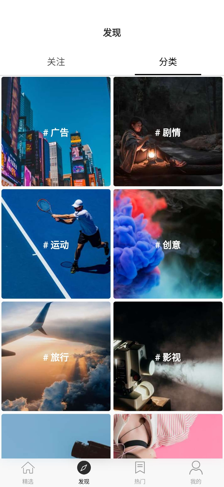
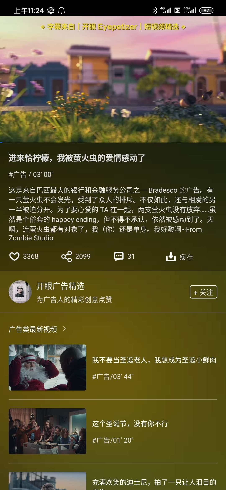

# Flutter Mvp

本项目是在学习Flutter过程中，利用业余时间开发的一款小项目，代码结构清晰，项目采用了传统的MVP模式。

项目中包含了Flutter在开发过程中常用控件(Widget)使用及部分自定的Widget。

本想项目使用了大量的过渡动画，使页面切换和Widget交互起来更加顺畅。

#界面
部分效果图如下
 
|     |      |    |
| :--------------------------------: | :---------------------------------: | :-------------------------------: |
|     |      |    |
|     |      |    |

**如果感觉这个项目对你有所帮助，希望给个Star鼓励下，谢谢~，同时欢迎提Issue**

## 使用技术及实现内容

- `Flutter`和原生交互的插件播放器封装使用 [插件地址](https://github.com/ViktSun/MVideoPlugin)

- 大量 `Flutter Animation` 使用

- 部分自定的控件使用 (自定义搜索框等)

- `Sliver` 复杂联动动画实现

- `Provider`状态管理使用

- 网络请求采用的是`Dio` ，对请求结果进行统一处理，使数据交互更加方便

- 部分页面的管理采用了`fluro` 路由进行管理

### 项目体验下载地址

- [点击下载](https://www.pgyer.com/zmFg)

- 下载密码：123456

- 扫码下载

  
  

## 编译运行流程

- 配置Flutter开发环境，详情见[官网](https://flutterchina.club/get-started/install/)

- Flutter Version v1.12.13+hotfix.5

- Dart Version 2.5.0

- clone 项目代码 执行 `flutter packages get ` 或者打开 pubspec.yaml文件 点击 Package get,建议配置国内镜像
详情见[官网](https://flutterchina.club/get-started/install/)

##注意事项

- 本项目暂不支持IOS，由于暂时没有开发IOS播放器插件

- 如果想体验的更流畅建议使用`release`版本，`debug`版本会有些许的卡顿属于正常现象

# 本项目采用的开源库
| 库                         |          功能             |
| -------------------------- | ------------------------ |
| [dio](https://github.com/flutterchina/dio)                            | **网络库**       |
| [provider](https://github.com/rrousselGit/provider)                   | **状态管理**     |
| [flutter_mvideo_plugin](https://github.com/ViktSun/MVideoPlugin)      | **播放器插件**   |
| [fluro](https://github.com/theyakka/fluro)                            | **路由管理**     |
| [flutter_oktoast](https://github.com/OpenFlutter/flutter_oktoast)     | **Toast工具**        |
| [common_utils](https://github.com/Sky24n/common_utils)                | **Dart 常用工具类库**     |
| [flustars](https://github.com/Sky24n/flustars)                        | **Flutter 常用工具类库**  |
| [rxdart](https://github.com/ReactiveX/rxdart)                         | **Dart的响应式扩展** |
| [sprintf](https://github.com/Naddiseo/dart-sprintf)                   | **String格式化工具**   |
| [logger](https://github.com/leisim/logger.git)                        | **Flutter 日志工具**   |
| [event_bus](https://github.com/marcojakob/dart-event-bus)             | **事件分发工具**   |
| [cached_network_image](https://github.com/renefloor/flutter_cached_network_image)             | **图片加载**       |
| [url_launcher](https://github.com/flutter/plugins/tree/master/packages/url_launcher)          | **启动URL的插件**    |
| [webview_flutter](https://github.com/flutter/plugins/tree/master/packages/webview_flutter)    | **WebView插件**     |
| [package_info](https://github.com/flutter/plugins/tree/master/packages/package_info)          |**获取应用信息插件**   |

## 更新日志
 
**V1.0.0**

- 初始出版完成，主要功能基本完成

## 后续计划

- 对代码进行优化及维护

- 把之前开发过程的踩坑以文章的形式总结

- 开发或引用IOS播放器插件，适配IOS

## 感谢

- [flutter-go](https://github.com/alibaba/flutter-go) 包含常规组件的使用工程

- [flutter_wanandroid](https://github.com/Sky24n/flutter_wanandroid) 玩安卓的Flutter客户端

- [KotlinMvp](https://github.com/git-xuhao/KotlinMvp) 感谢该项目的作者同意我使用本项目的UI。

- [flutter_deer](https://github.com/simplezhli/flutter_deer) 亮亮同学，现在同桌，基本同时开始踩坑Flutter,
但是在中途的时候由于我手头的项目需求比较多，所以这个项目的开发一直搁置，亮亮同学把踩的部分坑都会和我分享，
使我在开发的过程中少踩了许多坑。

- 感谢所有的开源项目

## 声明

**项目中的 API 均来自开眼视频，UI来自KotlinMvp,纯属学习交流使用，不得用于商业用途！**

## License

	Copyright 2019 ViktSun

    Licensed under the Apache License, Version 2.0 (the "License");
    you may not use this file except in compliance with the License.
    You may obtain a copy of the License at

       http://www.apache.org/licenses/LICENSE-2.0

    Unless required by applicable law or agreed to in writing, software
    distributed under the License is distributed on an "AS IS" BASIS,
    WITHOUT WARRANTIES OR CONDITIONS OF ANY KIND, either express or implied.
    See the License for the specific language governing permissions and
    limitations under the License.
